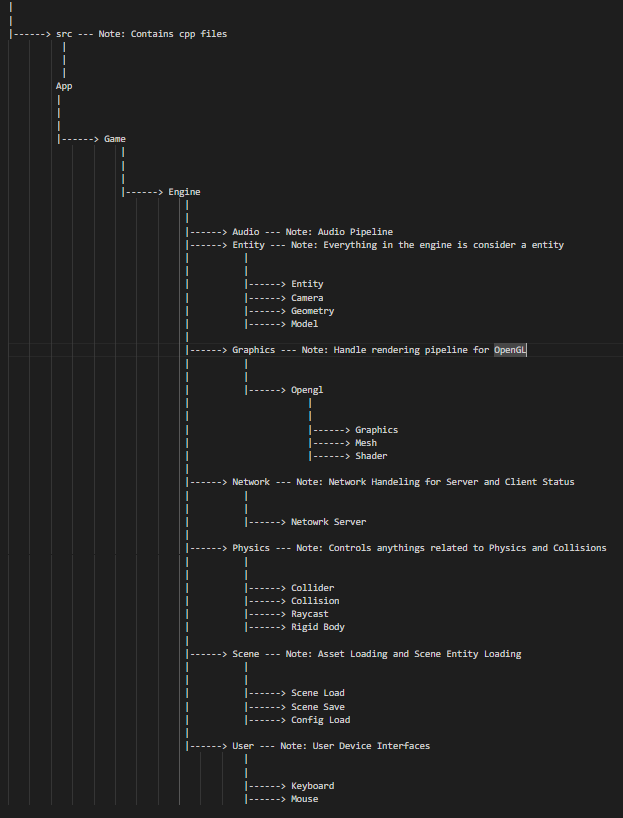

# Scene Information
- Code Name: Scene Bravo
- Description: Game Engine Scene, Early Pre Alpha Phase

# Update:
- 10/6/2025: Game Assets are not yet uploaded. Need to edit textures, will upload soon.

# External Libraries
- GLFW - Version 3.3
- ASSIMP - Version N/A
- GLAD - Version 0.1.36
- STB Image - Version 2.27
- OpenGL Mathematics (GLM) - Version 1.0.1
- Niels Lohmann JSON - Version 3.11.2

# Note
- Currently set up for Windows, with plans to set up on Arch Linux

# Compile Program
- Program is compiled with a makefile
- Edit the MAKEFILE to fit your external library paths.
- Windows: compile MAKEFILE with mingw32-make command

# Executable Program
- Program is found in the Bin, and opened from project root directory Ex: ./bin/main
- You will need project folder with assets and entitys, to build a scene. Coming Soon!!!

# Overview

- The game engine is broken into two parts. The "Game" and the "Engine", The thought process behind this, is "Game" can use modules from "Engine" to create a game. 

- The "Header File(s) .h" and "Src File(s) .cpp" are seperated into a include directory and src directory. Reasoning behind this was for the Makefile, seperation file file, and to not have bloated directories. Still on the fence with it.

- Entity is essentially a (ECS) Entity-Componentn-System, anything that can be spawend inside the 2D or 3D world is treated as such.

- "Engine" is made up of modules
    - Audio - Not Completed
    - Entity - Work In Progress
    - Graphics - Handels the OpenGL Render Pipeline, For example to Draw a Model, It starts at Entity -> Model -> Graphics & Meshes
    - Network - Handle everything network related, A network server can be spunned up or be used as a network client to connect to a server.
    - Physics - Consist of ... Colliders used for collisions and raycast systen... A Rigid Body system to create motion... And collision to check for collisions between 2x colliders.
    - Scene - This adds the ability to load and build scenes, from different saves. Will be renaming it to scene eventually because it makes better sense.
    - User - Not in use yet, but this will handle perphrials for user input such as mouse and keyboard.

- I like visualizing this project like a pyramid
    - Where App is at the Top, it the actual application for system, the actual EXE
    - Then there is Game the Middle, it the actual game area that uses engine to create to hearts content. You can afford to be a little sloppy.
    - Then there is Engine the Bottom, it's the foundation. Its made of components that can be used to build a game. This is where features are added. I see this as the level that talks to the machine/hardware.  

Note: Personally I like data flow moving in one direction and prefer it not going back in forth.

# Images
- Project Bravo Project Layout

- Project Bravo Screenshot

# URL Links For Demo Video and Development Updates
- Youtube: https://www.youtube.com/@weacedgames
- Discord: https://www.discord.gg/txRvpBW6CB
