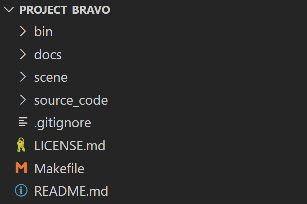
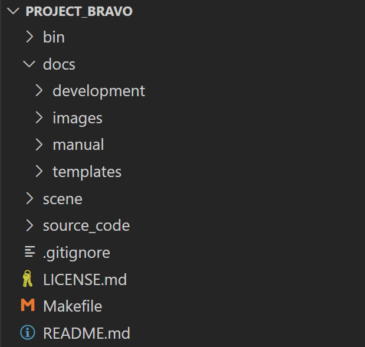
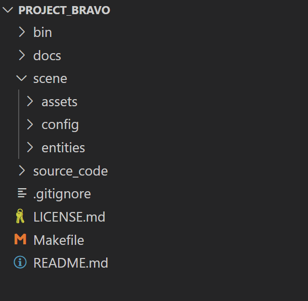

# NAVIGATION
- 🏠 [Home](../../../README.md)
- 📖 [Table of Contents](../docs_Chapter_0.00_Welcome/doc_Chapter_0.10_Table_of_Contents.md)

# CHAPTER
1.20

# TITTLE
Project Bravo Directory Layout

# DESCRIPTION
When you clone the repo, the repo should contain everything you need and thought as the root Project directory. Inside the `./scene` is used by the engine to build a scene. The Engine's source code is inside...........`./source_code` Documents can be found ing `./doc`. And the actual program under `./bin/main.exe`

# HIGHLIGHTS
- `./bin` Directory contains Main Program
- `./docs` Directory contains Manual and File Templates
- `./scene` Directory contains Game Asset Files
- `./source_code` Directory contains the Game Engine's source code

# BODY

- Root Directory Layout
    - 
    - This is Project Bravo's root Directory and contains everything needed
        - `./bin` Directory contains Main Program`.exe` and `.dll` files
        - `./docs` Directory contains Manual and File Templates for `.asset` and `.entity` files
        - `./scene` Directory contains Game Asset Files, such as Models, Images, Audio, `.asset` file(s), `.entity` file(s)
        - `./source_code` Directory contains the Game Engine's source code
        - `./LICENSE.md` File containing Licensening Details
        - `./Makefile` File is called a Makefile and used to compile Source Code
        - `./README` File describing project
#

- Bin Directory Layout
    - 
    - This is where the Main Program `.exe` and `.dll` files are located, neccessary to run the game program.
        - The Main program is located at `./bin/main.exe`. This is what the Makefile and Compiler outputs
        - ASSIMP uses `./bin/libassimp-6.dll`

#

- Docs Directory Layout
    - 
    - Project Bravo's User Manual, Images, and File Templates
        - File Templates for `.asset` file(s) and `.entity` file(s) 

#

- Scene Directory Layout
    - 
    - Directory contains Game Asset Files, such as Models, Images, Audio, `.asset` file(s), `.entity` file(s)
        - The Scene Directory and it's Sub Directory Structure is essential
        - The program looks for data in this folder during loading 
#

- Source Code Directory Layout
    - 
    - Directory contains the source code to build the engine and the game
        - Header files are located in `./source_code/include`
        - Source file are located in `./source_code/src`
        - External Libraries are located in `./source_code/libraries`
#

- Project Bravo Source Code Layout
    - 
    - Its made up of two parts 'Game' and 'Enginge'
        - Engine contains components that Game can use to build a Game