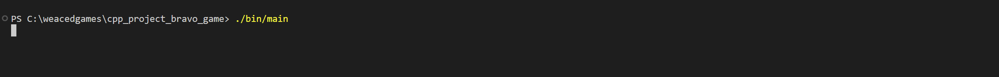
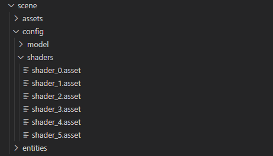

# NAVIGATION
- 🏠 [Home](../../../README.md)
- 📖 [Table of Contents](../docs_Chapter_0.00_Welcome/doc_Chapter_0.10_Table_of_Contents.md)

# CHAPTER
1.30

# TITLE
Project Bravo, How it Works?

# DESCRIPTION
This page will describe how Project Bravo's Engine works. Starting how game assets are loaded into the engine and then assigned a Asset ID. To how scene are built using the entity files.

# HIGHLIGHTS
- A Asset Config File contains a Asset's file paths and ID integer. The ID will be used so a Entity can be associated with it.
- A Entity File is used for Cameras, Models, and Geometry. It contains information such as Asset ID and a object Position, Rotation, and Scale.

# BODY

1. Starting Program
    - 
    - You start/run the program, with enter `./bin/main.exe` or `./bin/main` from the Project Bravo's root directoryS

2. Program Initialization
    - GLFW + GLAD are Initialized
    - OpenGL Window Size is Defined

3. Loading Game Asset Data
    - 
        - Contains Model Files for Game Assets
        - Contains Image Files for Game Assets
        - Contains Audio Files for Game Assets 
    - 
        - The Engine looks for `.asset` files
        - The Shader Asset file contains file paths to vertex and fragment shader
        - The Shader Asset file contains ID, that can be associated with a Entity 
    - 
        - The Engine looks for `.asset` files
        - The Model Asset file contains file path to model
        - The Model Asset file contains ID, that can be associated with a Entity

4. Loading Entity Data
    - 
        - The Engine looks for `.entity` files adding them to a list
        - The Entity file support spawn Entities for ...
            - Model(s)
                - Contains Shader ID to be linked with Shader
                - Contains Model ID to be linked with Model
                - Contains Scene Properties that can be used or edited
            - Geometry(s)
                - Contains Shader ID to be linked with Shader
                - Contains Scene Properties that can be used or edited
            - Camera(s)
                - Contains Scene Properties that can be used or edited

5. Building a Scene
    - 
        - The engine loops through the Entity list, using the Scene Properties set Position, Rotation, and Scale

6. Saving Entities
    - If needed entities that were changed during runtime can be saved to a temptentities directory inside of scene
