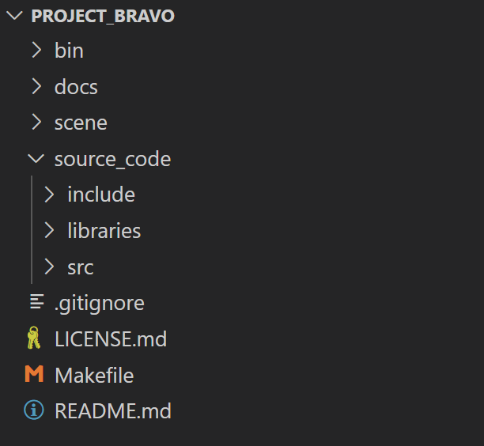
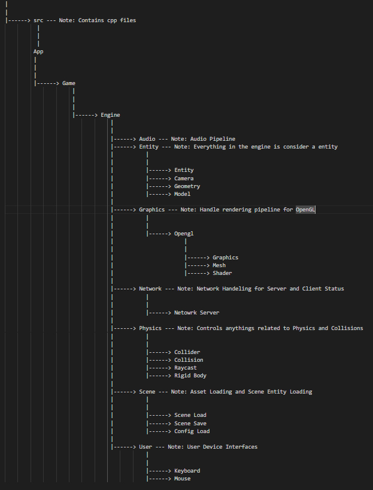

# NAVIGATION
- 🏠 [Home](../../../README.md)
- 📖 [Table of Contents](../docs_Chapter_0.00_Welcome/doc_Chapter_0.10_Table_of_Contents.md)

# CHAPTER
1.40

# TITTLE
Project Bravo's Source Code

# DESCRIPTION
- I like visualizing this project like a pyramid
    - Where App is at the Top, it the actual application for system
    - Then there is Game the Middle, it the actual game area that uses engine to create to hearts content. You can afford to be a little sloppy.
    - Then there is Engine the Bottom, it's the foundation. Its made of components that can be used to build a game. This is where features are added. I see this as the level that talks to the machine/hardware.

# HIGHLIGHTS
- Header Files `.h` can be found in `./source_code/include/...`
- Source Files `.cpp` can be found in `./source_code/src/...`
- 3rd Party External Libraries can be found in `./source_code/libraries/...`
- Game is where game logic is hard coded to make a game
- Engine is made up of Components that Game can use to make a game
- Source Code is compiled with a Makefile

# BODY

- Source Code Directory Layout
    - 
    - Directory contains the source code to build the engine and the game
        - `./source_code/include` Contains Header files 
        - `./source_code/src` Contains Source files
        - `./source_code/libraries` Contains 3rd Party External Libraries
            - GLFW - Version 3.3
            - ASSIMP - Version 6.0.2
            - GLAD - Version 0.1.36
            - STB Image - Version 2.27
            - OpenGL Mathematics (GLM) - Version 1.0.1
            - Niels Lohmann JSON - Version 3.11.2

#

- Project Bravo Source Code Flow Chart
    - 
    - Its made up of two parts 'Game' and 'Enginge', both `./source_code/include` and `./source_code/src` directories are structured the same way.
        - Audio: Not Operational
        - Entitiy: All spawnable objects in 2D and 3D world are referred to as a Entity
            - `Entity` Defines what a Entity is and contains
            - `Camera` Camera Class Handle
            - `Geometry` Geometery Class Handle for Cube
            - `Model` Model Class Handle
        - Graphics: Handles Opengl Pipeline and Data flows from Game
            - `Graphics` Main Handle for the Graphics Pipeline
            - `Mesh` Is used to draw meshes from loaded models
            - `Shader` Is used to handle Opengl Shaders
        - Network: Handles Networking for Server and Client
            - `Network Server` Handles Game Server, Work In Progress
        - Physics: Handles anything Physics Related
            - `Collider` Handles Axis Alligned Bouding Box
            - `Collision` Check for Axis Alligned Bounding Box collsion between to two AABB colliders
            - `Raycast` 3D Raycast Collision check for shooting
            - `Rigid Body` Used to create simple Motion
        - Scene: Handles the loading of Models and Entity Scene Game Data
            - `Scene Load` Loads Entity Files
            - `Scene Save` Saves Entities to Files
            - `Config Load` Load Asset File Data
        - User: Handles user input interface for periphials
            - `Keyboard` Handles User Keyboard input
            - `Mouse` Handles User Mouse Input