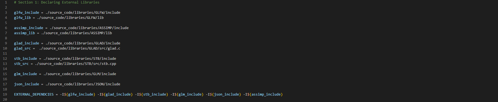
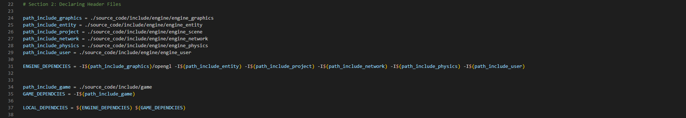
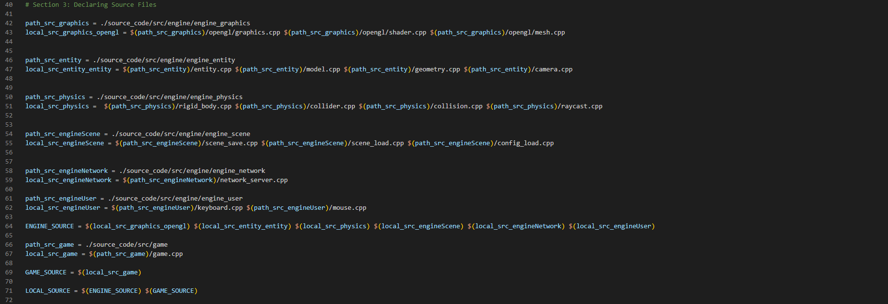
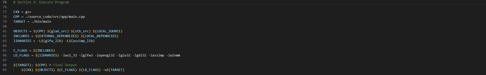

# NAVIGATION
- 🏠 [Home](../../../README.md)
- 📖 [Table of Contents](../docs_Chapter_0.00_Welcome/doc_Chapter_0.10_Table_of_Contents.md)

# CHAPTER
4.00

# TITTLE
Reading Project Bravo's Makefile

# DESCRIPTION
This describes how to read Project Bravo's Makefile.

# HIGHLIGHTS
- Section 1 of the Makefile, is used for declaring External Libraries
- Section 2 of the Makefile, is used for Declaring Local Headers Files
- Section 3 of the Makefile, is used for Declaring Local Source Files
- Section 4 of the Makefile, brings it all together as a command

# BODY

- Section 1 of the Makefile
    - 
    - 3rd Party External Libraies
        - Delcaring paths for 3rd Party External Libraies
        
- Section 2 of the Makefile
    - 
    - Local Project Header Files
        - Declaring paths for project header files

- Section 3 of the Makefile
    - 
    - Local Source Files
        - Declaring paths for project source files

- Section 4 of the Makefile
    - 
    - Command Makefile Prompt
        - This is where everything is put together as CLI command to be executed