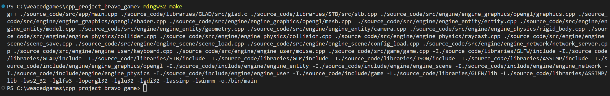
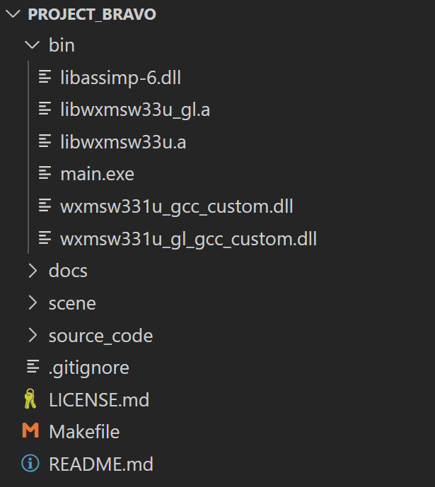

# NAVIGATION
- 🏠 [Home](../../../README.md)
- 📖 [Table of Contents](../docs_Chapter_0.00_Welcome/doc_Chapter_0.10_Table_of_Contents.md)

# CHAPTER
4.20

# TITTLE
How to Compile Source Code

# DESCRIPTION
This takes the Source Code and creates Executable Program ".exe"

# HIGHLIGHTS

# BODY
- Procedure 
1. Modify Makefile to your System's needs. Should not be needed if on Windows
2. Run Makefile with command "mingw32-make"
    - 
3. The Mingw Compiler will compile the code. If no error are found, a EXE will outputted to the bin directory
    - 

